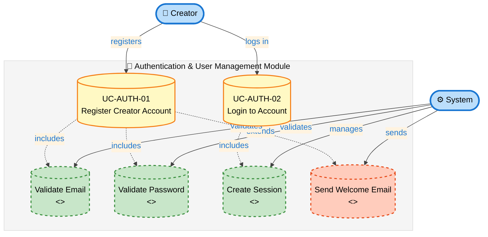
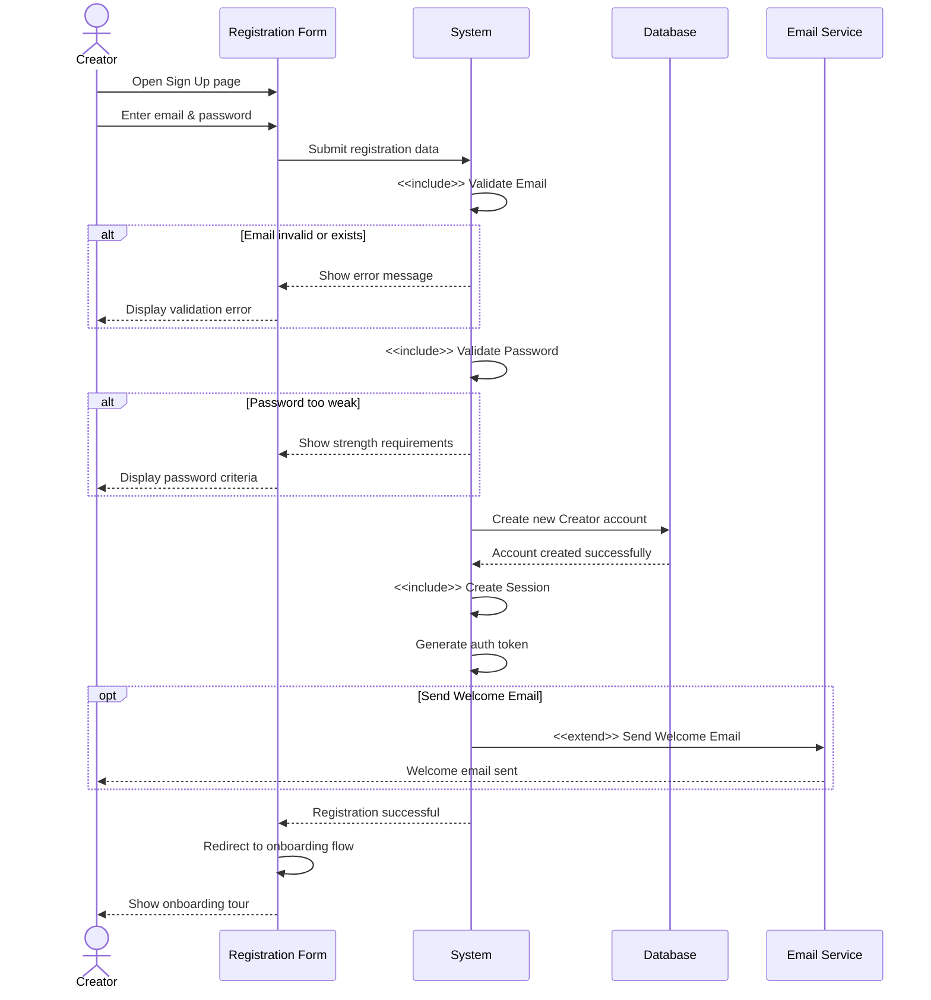
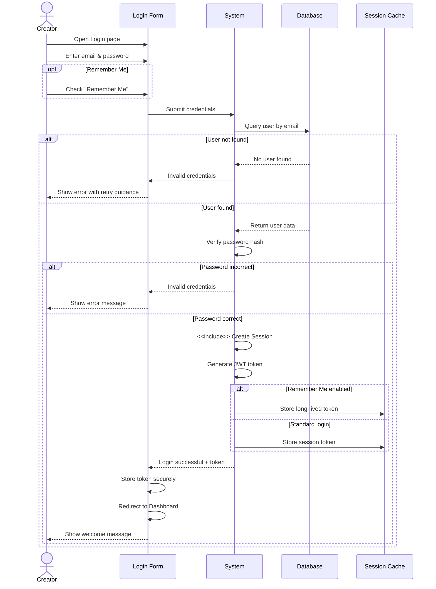
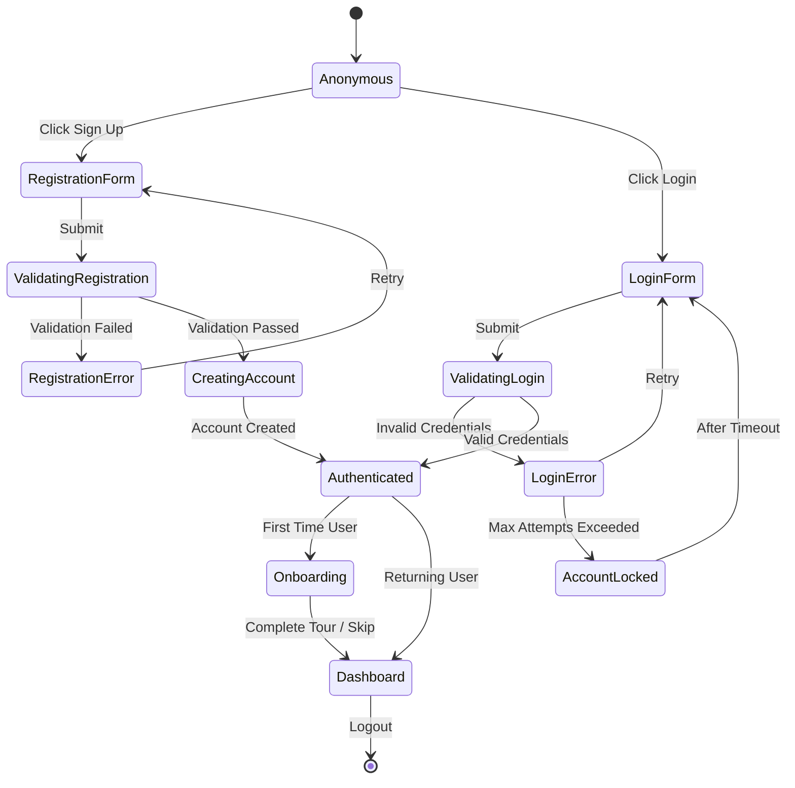
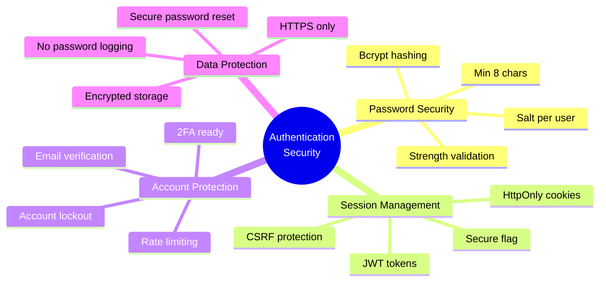
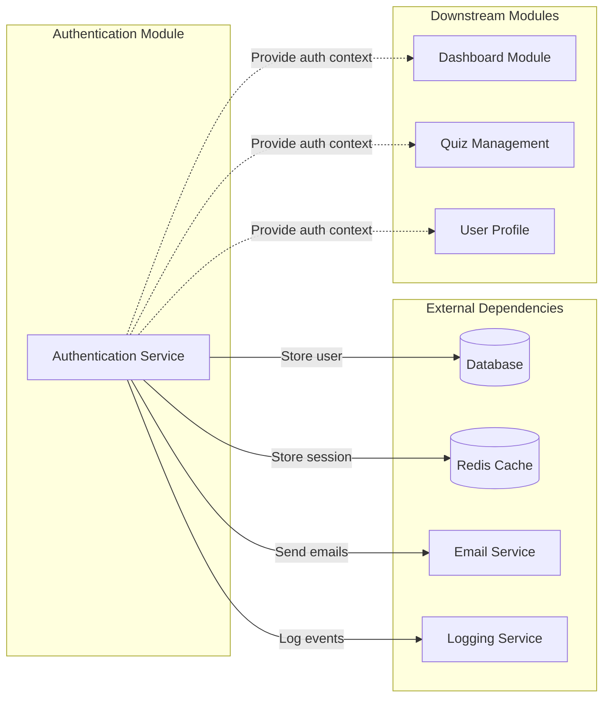

# Use Case Diagrams - ThinkTogether

**Document Version:** 1.0  
**Date:** 03/10/2025  
**Reference:** actors-and-usecases.md

---

## Module 1: Authentication & User Management



### Chi tiết Use Cases

#### **UC-AUTH-01: Register Creator Account**



**Business Rules:**
- BR-23: Email must be unique in system
- BR-24: Password minimum 8 characters
- Email format validation: RFC 5322 compliant
- Password strength: Mix of uppercase, lowercase, numbers recommended

**Acceptance Criteria:**
- ✅ Email uniqueness validation with real-time feedback
- ✅ Password strength indicator displayed
- ✅ Clear error messages for validation failures
- ✅ Auto-login after successful registration
- ✅ Redirect to onboarding flow

---

#### **UC-AUTH-02: Login to Account**



**Business Rules:**
- Session timeout: 24 hours (standard), 30 days (Remember Me)
- Maximum login attempts: 5 per 15 minutes
- Account lockout: 30 minutes after 5 failed attempts

**Acceptance Criteria:**
- ✅ Clear error messages for incorrect credentials
- ✅ Loading state during authentication
- ✅ Remember me functionality with secure token storage
- ✅ Redirect to dashboard with welcome message
- ✅ Account lockout protection against brute force

---

### Authentication Flow Overview



---

### Error Handling Matrix - Authentication Module

| Scenario | Error Code | User Message | System Action |
|----------|------------|--------------|---------------|
| Email already exists | AUTH_001 | "This email is already registered. Try logging in instead." | Suggest login link |
| Invalid email format | AUTH_002 | "Please enter a valid email address." | Highlight field |
| Weak password | AUTH_003 | "Password must be at least 8 characters with mix of letters and numbers." | Show strength meter |
| Invalid credentials | AUTH_004 | "Incorrect email or password. Please try again." | Increment attempt counter |
| Account locked | AUTH_005 | "Too many failed attempts. Please try again in 30 minutes." | Lock account temporarily |
| Session expired | AUTH_006 | "Your session has expired. Please log in again." | Redirect to login |
| Network error | AUTH_007 | "Connection error. Please check your internet and try again." | Enable retry button |

---

### Security Considerations



---

### Validation Rules Detail

#### Email Validation
```javascript
// Pseudo-code for email validation
function validateEmail(email) {
  // Format check
  const emailRegex = /^[^\s@]+@[^\s@]+\.[^\s@]+$/;
  if (!emailRegex.test(email)) {
    return { valid: false, error: "Invalid email format" };
  }
  
  // Real-time uniqueness check
  const exists = await checkEmailExists(email);
  if (exists) {
    return { valid: false, error: "Email already registered" };
  }
  
  return { valid: true };
}
```

#### Password Validation
```javascript
// Pseudo-code for password validation
function validatePassword(password) {
  const rules = {
    minLength: password.length >= 8,
    hasUpperCase: /[A-Z]/.test(password),
    hasLowerCase: /[a-z]/.test(password),
    hasNumber: /[0-9]/.test(password),
  };
  
  const strength = Object.values(rules).filter(Boolean).length;
  
  return {
    valid: rules.minLength,
    strength: strength === 4 ? 'Strong' : 
             strength === 3 ? 'Medium' : 'Weak',
    rules: rules
  };
}
```

---

### UI/UX Guidelines - Authentication

#### Registration Form Requirements
- **Progressive disclosure:** Show password requirements on focus
- **Real-time validation:** Validate email on blur
- **Visual feedback:** 
  - ✅ Green check for valid inputs
  - ❌ Red X for invalid inputs
  - 🔄 Loading spinner during async validation
- **Accessibility:**
  - ARIA labels for all fields
  - Error messages announced by screen readers
  - Keyboard navigation support

#### Login Form Requirements
- **Remember me:** Checkbox with tooltip explaining duration
- **Forgot password:** Link prominently displayed
- **Social login:** Ready for future OAuth integration
- **Loading states:** Disable button and show spinner during authentication

---

### Integration Points



---

### Testing Scenarios

#### Unit Tests
- ✅ Email validation logic
- ✅ Password strength calculation
- ✅ Password hashing
- ✅ Token generation
- ✅ Session management

#### Integration Tests
- ✅ Complete registration flow
- ✅ Complete login flow
- ✅ Remember me functionality
- ✅ Account lockout mechanism
- ✅ Session expiration

#### E2E Tests
- ✅ New user registration journey
- ✅ Returning user login journey
- ✅ Failed login attempts
- ✅ Password recovery flow
- ✅ Session persistence across browser refresh

---

**Next Modules:**
- Module 2: Quiz Management
- Module 3: Question Management
- Module 4: Live Game Mode
- Module 5: Challenge Mode
- Module 6: Reporting & Analytics

